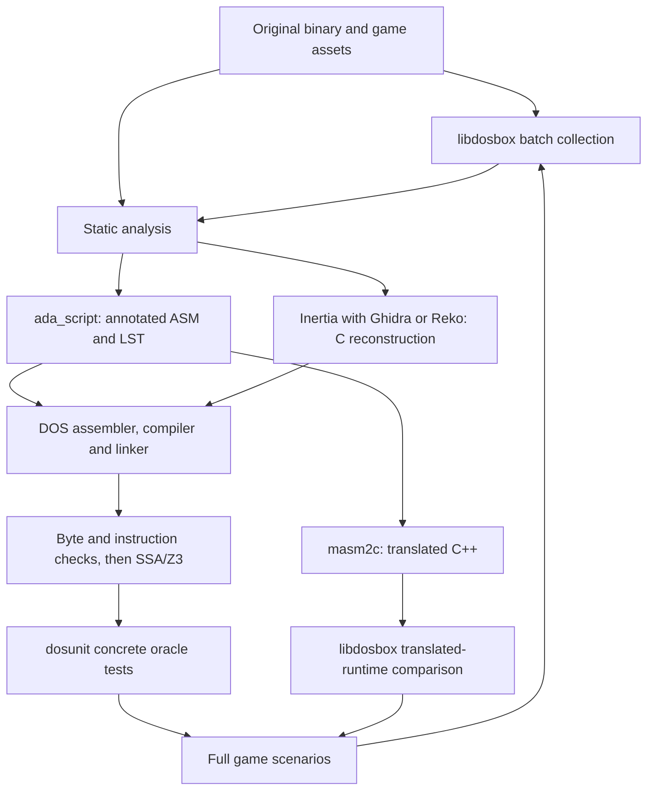

# Inertia Decompiler

Inertia Decompiler is a toolchain for decompiling and comparing 16-bit and
32-bit real-mode DOS programs. It supports the DOS segmented-memory model and
processes real-mode `.EXE`, `.COM`, and assembly listings from DOS-era
toolchains.

Inertia Decompiler uses a dual-license model. Community use is available under
the GNU Affero General Public License, version 3 or any later version. A separate
commercial license is available for organizations that need rights outside the
AGPL's conditions. See [License](#license).

Correctness comes before pretty C. When evidence is weak, the tools prefer low-level output, visible refusals, or explicit fallback reports over guessed source.

## Why Inertia For DOS

Inertia focuses on the results that matter when restoring a DOS program:

- **More of the program becomes C.** The goal is to recover every function
  instead of silently omitting difficult functions or leaving most of the
  program as an assembly listing.
- **The C is checked against the executable.** Recovered conditions, calls,
  return values, and memory changes are validated. Code that looks cleaner but
  changes the program's behavior is rejected.
- **The output is intended to compile.** Inertia can generate portable C or C
  suitable for Microsoft C on DOS. It checks for common decompiler failures such
  as wrong function arguments, incompatible pointer types, missing declarations,
  and invalid assignments.
- **The output is easier to understand.** Proven stack locations become
  arguments and local variables, branches become meaningful conditions, and
  repeated memory layouts can become arrays or structures. When a readable
  interpretation cannot be proved, Inertia keeps a lower-level representation
  instead of inventing one.
- **Stripped executables are first-class inputs.** Debug files and original
  source are not required. When old `.COD`, `.LST`, `.MAP`, CodeView, or TDInfo
  files are available, they can restore useful names and source locations.
- **Library code creates less noise.** Signatures from old DOS compilers,
  object files, and libraries help identify runtime and library functions so the
  report stays focused on the program's own code.
- **You can test whether a rebuild still behaves like the original.** Included
  comparison tools can run both versions and compare function results, changed
  memory, and other externally visible behavior.
- **Uncertain output is clearly marked.** Timeouts, incomplete recovery, failed
  validation, and fallback output remain visible. A plausible-looking function
  is not presented as trustworthy C without supporting evidence.

No decompiler can reconstruct every original name, type, or source construct
from machine code. Inertia is designed for cases where complete, recompilable,
behaviorally checked C is more useful than attractive but unverified pseudocode.

## Install

PKLITE-packed MZ inputs use the optional native [Deark](https://github.com/jsummers/deark)
decoder (`deark` on PATH or `INERTIA_DEARK_PATH`). Function catalog recovery has
its own `--catalog-timeout` budget, defaulting to 60 seconds. See
[catalog, unpacking and DOS-tool setup](reference/pr1-adoption.md) for limitations
and installation hints. Required compiler checks are not silently skipped.

The repo is tested against the angr stack pinned in [pyproject.toml](pyproject.toml).

```bash
git submodule update --init --recursive
python3.11 -m venv .venv
source .venv/bin/activate
python -m pip install --upgrade pip
python -m pip install -r requirements.txt
python -m pip install -e .
python -m pip install -e ".[test]"
```

The root `./decompile.py` wrapper re-execs through `./.venv/bin/python` when that virtualenv exists.

## DOS Game Reconstruction Workflow

Use this order for C, assembly, and mixed DOS games:



Use the real-mode model for both 16-bit instructions and 386 instructions with
32-bit operands/addresses in real mode. EAX usage does not make a program a
flat32 executable. Protected-mode DOS extenders and the PE32 MSC compiler
binaries require separate loaders/contracts; see the
[flat32 comparator](artifacts/msc8-z3cmp32/README.md).

The commands below are a **local workflow template**. CLI options and relevant
source paths were checked on 2026-09-26; a complete game run was not performed
for this documentation. Replace the game paths, configuration and build recipe.
Do not proceed past a failed stage or treat missing artifacts as success.

### 1. Prepare inputs and isolate each run

Required inputs are the original executable, its game assets, CPU/memory mode,
and a reproducible scenario. Optional inputs include IDC, MAP/LST/COD, symbols,
original ASM/C, runtime dumps and library signatures. Preserve originals; run
the game from a copy because games and instrumentation can write files.

```bash
export VEXTEST=/home/xor/vextest
export PY="$VEXTEST/.venv/bin/python"
export PYTHON_JIT=1
export ADA="$VEXTEST"
export MASM2C=/home/xor/masm2c
export LIBDOSBOX=/home/xor/inertia_player/libdosbox
export MZTOOLS=/home/xor/games/f19ru/F19/mzretools/build
export WORK="$VEXTEST/.cache/game-reconstruction/run-001"
export GAME_SOURCE=/absolute/path/to/original-game-directory
export GAME_EXE=GAME.EXE

mkdir -p "$WORK"/{game,analysis,src,build,reports,runtime,translated}
cp -a "$GAME_SOURCE/." "$WORK/game/"
export ORIGINAL="$WORK/game/$GAME_EXE"
export CANDIDATE="$WORK/build/REBUILT.EXE"
sha256sum "$GAME_SOURCE/$GAME_EXE" "$ORIGINAL" > "$WORK/reports/input.sha256"
```

Use a fresh `WORK` for each collection scenario. Record component revisions and
local changes, compiler/linker flags, DOSBox settings, scenario actions, limits,
and artifact hashes. Runtime evidence must include actual load-segment metadata.
Never confuse file offsets, analysis VAs, module offsets and runtime CS:IP.

| Artifact | Required content / consumer |
| --- | --- |
| Runtime JSON | Executed code, observed edges, segment values, access widths/directions, pointer evidence and load metadata; ada_script and dosunit import |
| ASM/LST and analysis DB | Bytes, labels, boundaries and annotations; reassembly, masm2c and catalog discovery |
| Function catalogs + mapping | Original/candidate correspondence with correct address model; SSA and concrete comparisons |
| Candidate + build record | Linked image, maps, retained objects, exact toolchain/options; comparison input |
| Test vectors | Registers, flags, segments, valid memory, stack/return setup and observables; concrete execution |
| Proof/test reports | Requested coverage, passes, mismatches, conditional results, refusals and assumptions; acceptance review |

### 2. Collect initial runtime evidence in batch mode

The local instrumentation build is
`$LIBDOSBOX/build/custom-instrument/dosbox`. To build it when needed:

```bash
"$LIBDOSBOX/scripts/build_custom.sh" instrument
```

Prepare `$WORK/runtime/dosbox.conf` for the game's machine, CPU, cycles and
devices. Use `core = normal` in its `[cpu]` section for the inspected normal-core
collection hooks. The instrumentation build starts in its analysis profile and
has original-code collection without converted-game dispatch.

```bash
DOSBOX_BIN="$LIBDOSBOX/build/custom-instrument/dosbox"
run_status=0
timeout --signal=TERM --kill-after=10s 30s \
  "$DOSBOX_BIN" --noprimaryconf --nolocalconf --noautoexec \
  --conf "$WORK/runtime/dosbox.conf" "$ORIGINAL" \
  > "$WORK/reports/collection.log" 2>&1 || run_status=$?
printf '%s\n' "$run_status" > "$WORK/reports/collection.exit"
```

This bounds an unattended startup run; it does not automate menu/gameplay input.
Use recorded scenario inputs or a game-specific driver for deeper coverage.
A display is needed unless a headless display setup has been validated for the
chosen renderer. Do not assume dummy SDL video/audio preserves a game scenario.

The inspected instrument source dumps JSON on program exit and SIGTERM/SIGINT.
Exit 124 records a timeout, not successful completion; SIGKILL cannot guarantee
a dump. Locate the `Dumping run-time info into ...` path in `collection.log`,
copy that artifact to `$WORK/runtime/trace.json`, and inspect it before continuing:

```bash
export TRACE="$WORK/runtime/trace.json"
"$PY" - "$TRACE" <<'PY'
import json
import sys
from pathlib import Path

trace = json.loads(Path(sys.argv[1]).read_text())
assert isinstance(trace.get('Meta', {}).get('DosboxLoadSeg'), int), 'missing load segment'
assert trace.get('Code'), 'no executed-code evidence'
print('load segment:', hex(trace['Meta']['DosboxLoadSeg']))
print('code sites:', len(trace['Code']), 'data sites:', len(trace.get('Data', {})))
print('call snapshots:', len(trace.get('CallSnapshots', [])))
PY
```

Confirm the log identifies the intended executable; startup may launch overlays
or child programs. Check dump freshness and retain separate module identities.
Memory dumps and metadata are additional artifacts, not guaranteed by this JSON
collection command. Access widths suggest byte/word/dword uses; they do not by
themselves prove complete C types. Unobserved code is not dead code.

### 3. Analyze with ada_script, Inertia, Ghidra and Reko

Run ada_script in an isolated working directory: its loader recreates
`analysis.db` in the current directory. For supported MZ inputs:

ada_script is now included in this checkout. Install its IDC parser dependency
with `uv pip install --python "$PY" -e "$VEXTEST[ada]"` (or use pip from that
environment). The imported sources are pinned under `vendor/ada_script`; the
integrated CLI and signature adapter are under `tools/ada_script`.

```bash
(
  cd "$WORK/analysis"
  "$PY" "$ADA/ada.py" "$ORIGINAL" \
    --runtime "$TRACE" --full --classify --xrefs \
    -o "$WORK/reports/ada.md"
)
export LISTING="$WORK/analysis/${GAME_EXE%.*}.lst"
export ASSEMBLY="$WORK/analysis/${GAME_EXE%.*}.asm"
"$PY" "$VEXTEST/z3func.py" discover --exe "$ORIGINAL" \
  --ida-listing "$LISTING" --out "$WORK/analysis/original.functions.json"
"$PY" "$VEXTEST/z3func.py" import-libdosbox --trace "$TRACE" \
  --functions "$WORK/analysis/original.functions.json" \
  --out "$WORK/analysis/runtime-evidence.json"
```

Add `--idc-script /absolute/path/game.idc` when available. Inspect proposed
function boundaries and address mappings. The imported evidence document is
not itself a vector file. Aggregate-only traces provide priorities/access
ranges; replay requires adequate per-call snapshots and explicit vector export.

Library naming uses Inertia's shared PAT matcher before ASM/LST rendering.
The automatic catalog includes library-archive provenance; use repeatable
`--signature-catalog /path/runtime.pat` for explicit catalogs, or
`--no-signatures` to disable it. Matched library names replace automatic labels,
while explicit user/IDC names survive. Conflicting matches stay unnamed and
are recorded in `signatures.json` and the SQLite `signature_matches` table.
See [Ada Script integration](tools/ada_script/README.md) for controls and tests.

Generate C independently from the original binary:

```bash
INERTIA_ENABLE_TAIL_VALIDATION=1 "$PY" "$VEXTEST/decompile.py" "$ORIGINAL" \
  --c-target msc-dos --output-c-dir "$WORK/src/inertia" \
  --dump-layers --dump-layer-dir "$WORK/analysis/layers" \
  > "$WORK/reports/inertia.log" 2>&1
```

Use `--c-target portable-flat` for a native reconstruction and `--addr` for a
focused function. Output/validation failures remain work items.

Open the same hashed binary in Ghidra and/or Reko with the correct loader,
CPU mode and load addresses. Record their function boundaries, cross-references,
type hypotheses and pseudocode under `analysis/ghidra` or `analysis/reko`.
Reconcile disagreements against bytes and observations. These tools complement
Inertia; bidirectional import and direct runtime-JSON ingestion into Inertia
are integration work, not flags provided by the commands above. Do not infer
semantics by parsing another decompiler's rendered C.

### 4. Build one of two candidate types

**DOS reconstruction:** assemble recovered ASM, progressively replace routines
with C, and use the target compiler/assembler/linker and appropriate CRT.
Produce `$CANDIDATE` plus `$WORK/build/rebuilt.map`. A `.obj` is useful build
evidence, but the current binary-comparison pipeline needs a linked image.
Use the game's build recipe: memory model, near/far ABI, segment order, startup,
libraries and compiler options are not interchangeable across games.

**Native translation:** translate a copy of the recovered ASM with masm2c:

```bash
cp "$ASSEMBLY" "$WORK/translated/"
LOADSEG=$("$PY" -c 'import json,sys; print(hex(json.load(open(sys.argv[1]))["Meta"]["DosboxLoadSeg"]))' "$TRACE")
(
  cd "$WORK/translated"
  "$MASM2C/.venv/bin/python" "$MASM2C/masm2c.py" \
    -j 1 -m separate -lo "$LOADSEG" "${GAME_EXE%.*}.asm"
)
```

Build the resulting C++ with the game's masm2c/libdosbox runtime integration;
translation alone does not link a native game. Preserve segment layout and
dispatch mappings. Use faithful runtime settings, not `M2CDEBUG == -1`, for
acceptance. Native translated code needs a guest-state adapter for dosunit;
do not feed it to the DOS-image runner or assume flat32 Z3 proves its relation
to segmented original code. Use libdosbox translated-runtime comparison while
that adapter is absent. Existing ASM source can enter this workflow directly.

### 5. Compare linked DOS binaries: instructions, then SSA/Z3

First check supported MZ instructions with the local mzretools (v1.0.20):

```bash
"$MZTOOLS/mzdiff" "$ORIGINAL" "$CANDIDATE" \
  --map "$WORK/analysis/original.map" --tmap "$WORK/build/rebuilt.map:link" \
  > "$WORK/reports/mzdiff.log" 2>&1
```

This requires a prepared mzretools reference map; an arbitrary linker MAP is
not that map format. For supported inputs without one, omit both map options
for a limited entry-point comparison. Copy maps into the workdir because
mzdiff can emit a companion `.tgt` map. Do not use ignore/skip/loose settings
as acceptance. Its documented MZ/8086 scope is not verified 386 coverage.

Create the candidate catalog and mapping using the original catalog from step 3:

```bash
"$PY" "$VEXTEST/z3func.py" discover --exe "$CANDIDATE" \
  --map "$WORK/build/rebuilt.map" --out "$WORK/analysis/candidate.functions.json"
"$PY" "$VEXTEST/z3func.py" make-mapping \
  --oracle-functions "$WORK/analysis/original.functions.json" \
  --candidate-functions "$WORK/analysis/candidate.functions.json" \
  --out "$WORK/analysis/mapping.json"
```

Review the mapping before proving anything; names propose correspondence, they
do not prove it. Use an explicit ABI/observable contract for assembly routines
instead of assuming the default `msc16-near` ABI in this example:

```bash
"$PY" "$VEXTEST/z3func.py" ssa --exe "$ORIGINAL" \
  --functions "$WORK/analysis/original.functions.json" \
  --cache-dir "$WORK/build/ssa-cache" --out "$WORK/analysis/original.ssa.json"
"$PY" "$VEXTEST/z3func.py" ssa --exe "$CANDIDATE" \
  --functions "$WORK/analysis/candidate.functions.json" \
  --cache-dir "$WORK/build/ssa-cache" --out "$WORK/analysis/candidate.ssa.json"
"$PY" "$VEXTEST/z3func.py" compare-ssa \
  --oracle-ssa "$WORK/analysis/original.ssa.json" \
  --candidate-ssa "$WORK/analysis/candidate.ssa.json" \
  --mapping "$WORK/analysis/mapping.json" --out "$WORK/reports/z3.json"
"$PY" "$VEXTEST/z3func.py" report-failures \
  --results "$WORK/reports/z3.json" --out "$WORK/reports/z3.md"
```

For process-bounded comparison of larger selections, see
[Z3 Function Comparator](#z3-function-comparator).

Byte identity, mapped instruction agreement and Z3 semantic equivalence are
different results. Run eligible SSA/Z3 checks before concrete dosunit tests.
Keep timeouts/refusals and normalization assumptions visible; a partial-region
proof is not a whole-function proof. Preserve counterexamples for replay.

### 6. Run concrete oracle tests, then full game scenarios

With reviewed `original.functions.json`, `candidate.functions.json` and
`mapping.json` under `$WORK/analysis`, generate bounded vectors and inspect
their pointer/memory, stack and return setup before execution:

```bash
"$PY" "$VEXTEST/z3func.py" gen-vectors --exe "$ORIGINAL" \
  --functions "$WORK/analysis/original.functions.json" --strategy edge \
  --max-vectors-per-function 8 --out "$WORK/analysis/vectors.json"

export DOSUNIT_KVIKDOS_C=/home/xor/kvikdos/kvikdos.c
export DOSUNIT_CACHE_DIR="$WORK/build/dosunit-cache"
"$PY" "$VEXTEST/z3func.py" record-oracle --exe "$ORIGINAL" \
  --functions "$WORK/analysis/original.functions.json" \
  --vectors "$WORK/analysis/vectors.json" --backend libkvikdos \
  --out "$WORK/analysis/oracle-vectors.json"
"$PY" "$VEXTEST/z3func.py" compare --candidate "$CANDIDATE" \
  --functions "$WORK/analysis/candidate.functions.json" \
  --vectors "$WORK/analysis/oracle-vectors.json" \
  --mapping "$WORK/analysis/mapping.json" --backend libkvikdos \
  --out "$WORK/reports/concrete.json"
"$PY" "$VEXTEST/z3func.py" report-failures \
  --results "$WORK/reports/concrete.json" --out "$WORK/reports/concrete.md"
```

The current libkvikdos backend builds a cached wrapper from `kvikdos.c`; it
needs the native compiler and usable KVM access. Smoke-test it on a small
fixture before a game batch. Backend failure is not candidate equivalence.
The fixture backend tests orchestration, not the actual executable.

Add boundary cases, realistic snapshots and realizable Z3 counterexamples.
Run tested/proved functions as well as symbolic refusals; retain handwritten
C tests for readable intent. Finish with loading, menus, gameplay transitions,
input, graphics, sound, saving/loading and exit as applicable. Reset resources
between original/candidate runs and record scenario coverage. Preserve the
live guest-memory contract of `m2c::m` when using libdosbox.

Track independent per-function build, instruction-match, symbolic-proof and
concrete-test statuses, plus whole-game scenario results. Missing/unmapped
functions stay in the denominator. See the
[toolchain guide](reference/dos-c-reconstruction-toolchain.md) and
[component integration plan](reference/dos-game-toolchain-integration.md).

## Decompile

Main entry points:

- `./decompile.py`
- `python -m inertia_decompiler.cli`
- installed script: `decompile-x86-16`

Common runs:

```bash
./decompile.py PROGRAM.EXE
./decompile.py PROGRAM.COM
./decompile.py PROGRAM.EXE --addr 0x11423 --timeout 30
./decompile.py LISTING.COD --proc _main --proc-kind NEAR
./decompile.py blob.bin --blob --base-addr 0x1000 --entry-point 0x1000
```

Useful options:

- `--addr ADDR`: decompile one function by linear address.
- `--proc NAME`: extract one procedure from a `.COD` listing.
- `--max-functions N`: cap whole-binary output.
- `--timeout SEC`: bound analysis for a function or run.
- `--window BYTES`: bound CFG recovery around a target address.
- `--c-target portable-flat|msc-dos`: choose generated C target helpers.
- `--api-style modern|dos|raw|pseudo|service|msc|compiler`: choose helper naming style.
- `--show-asm`: print the first lifted block before C.
- `--trace-c-stages`: print labeled generated-C snapshots.
- `--dump-layers --dump-layer-dir DIR`: write per-stage C artifacts.
- `--function-discovery-backend auto|angr|rizin|hybrid`: choose whole-binary discovery.
- `--signature-catalog PATH`: apply a PAT catalog built from `.pat`, `.obj`, and `.lib`.
- `-q` or `INERTIA_BRIEF=1`: reduce progress and diagnostics.

Tail validation can be enabled for decompiler correctness checks:

```bash
INERTIA_ENABLE_TAIL_VALIDATION=1 ./decompile.py SORTDEMO.EXE
```

When a run is slow, capture compact telemetry:

```bash
INERTIA_OTEL_SPANS=1 \
INERTIA_OTEL_SPAN_FILE=angr_platforms/.cache/otel.trace.txt \
./decompile.py PROGRAM.EXE --addr 0x11423
```

See [reference/telemetry.md](reference/telemetry.md) for trace formats and OTLP export.

## Inputs And Sidecars

Supported executable inputs:

- `.COM`
- DOS MZ `.EXE`
- 16-bit NE `.EXE` at smoke level
- `.BIN` / `.RAW` blobs
- `.COD` listings as direct procedure inputs

Metadata sidecars are optional but useful:

- `.COD` and `.LST`: procedure ranges, labels, local names, and source-backed hints.
- `.MAP`: public symbols and layout.
- CodeView NB00/NB02/NB04/NB08/NB09: debug names, procedures, stack variables, source files, line maps, type names, and member records where supported.
- TDInfo: Borland/Turbo Debugger symbols, stack/register/constant symbols, compact type descriptors, structs, unions, and enums.
- `.pat`, `.obj`, `.lib`: library signature matching.

Inspect embedded debug metadata directly:

```bash
./dump_debug_info.py PROGRAM.EXE
```

More format detail lives in [CODEVIEW_SUPPORT.md](CODEVIEW_SUPPORT.md), [DOS_COMPILER_SUPPORT.md](DOS_COMPILER_SUPPORT.md), [NE_WIN16_SUPPORT.md](NE_WIN16_SUPPORT.md), and [NE_LOADER_INTEGRATION_VERIFIED.md](NE_LOADER_INTEGRATION_VERIFIED.md).

## 80386 Real-Mode Frontend

The x86-16 frontend supports i386 programs running in real mode, including
32-bit general-purpose registers, FS and GS, and 32-bit operand and address
forms. Memory retains the DOS segmented model: segment registers select distinct
address spaces and 16-bit or 32-bit offsets are interpreted within the active
segment.

## Signature Catalogs

Build one deduplicated catalog from FLAIR `.pat`, OMF `.obj`, and OMF `.lib` inputs:

```bash
python scripts/build_signature_catalog.py signature_catalogs/ QLINK/ \
  --output signature_catalogs/local.pat
```

Use it during decompilation:

```bash
./decompile.py PROGRAM.EXE --signature-catalog signature_catalogs/local.pat
```

Build a shareable all-compilers bundle when the local compiler archive exists:

```bash
python scripts/build_compiler_catalog_bundle.py
```

Report likely compiler/runtime matches for a binary:

```bash
python scripts/report_compiler_matches.py PROGRAM.EXE \
  --catalog signature_catalogs/all_compilers_catalog_bundle.zip
```

Add `--compilers-only` for a short ranked compiler list.

## MS C Compiler And Flag Diagnostics

The compiler matcher can also score likely Microsoft C 5.1 flag combinations when profile data is available:

```bash
python scripts/build_msc51_flag_profiles.py \
  --cod-dir deep \
  --output signature_catalogs/msc51_flag_profiles.json

python scripts/report_compiler_matches.py PROGRAM.EXE \
  --catalog signature_catalogs/all_compilers_catalog_bundle.zip \
  --detect-flags-msc51 \
  --msc51-flag-profiles signature_catalogs/msc51_flag_profiles.json
```

The decompiler also has an internal MS C 5.1 local-variable hash diagnostic. It checks whether recovered local names and BP offsets fit the compiler's 16-bucket allocation pattern; this is used as evidence, not as a source of guessed names.

## Z3 Function Comparator

`./z3func.py` is the main static and concrete function-comparison tool. `./dosunit.py` exposes the same flow for compatibility.

Typical static SSA comparison:

```bash
./z3func.py discover --exe original.exe --map original.map --out /tmp/orig.functions.json
./z3func.py discover --exe rebuilt.exe --map rebuilt.map --out /tmp/rebuilt.functions.json

./z3func.py make-mapping \
  --oracle-functions /tmp/orig.functions.json \
  --candidate-functions /tmp/rebuilt.functions.json \
  --out /tmp/mapping.json

./z3func.py ssa \
  --exe original.exe \
  --functions /tmp/orig.functions.json \
  --cache-dir .cache/dosunit \
  --out /tmp/orig.ssa.json

./z3func.py ssa \
  --exe rebuilt.exe \
  --functions /tmp/rebuilt.functions.json \
  --cache-dir .cache/dosunit \
  --out /tmp/rebuilt.ssa.json

./z3func.py compare-ssa \
  --oracle-ssa /tmp/orig.ssa.json \
  --candidate-ssa /tmp/rebuilt.ssa.json \
  --mapping /tmp/mapping.json \
  --out /tmp/ssa.results.json

./z3func.py report-failures \
  --results /tmp/ssa.results.json \
  --out /tmp/ssa.failures.md
```

For large programs, prefer the batched comparator:

```bash
./z3func.py compare-ssa-batched \
  --oracle-ssa /tmp/orig.ssa.json \
  --candidate-ssa /tmp/rebuilt.ssa.json \
  --oracle-index-ssa /tmp/orig.ssa.json \
  --candidate-index-ssa /tmp/rebuilt.ssa.json \
  --mapping /tmp/mapping.json \
  --out-dir /tmp/ssa-batches \
  --out /tmp/ssa-batches/aggregate.json
```

Other useful comparator subcommands:

- `complexity`: classify which functions are good bounded-Z3 targets.
- `regions` / `compare-regions`: compare lifter-backed operand/effect summaries.
- `compare-ssa-abi`: prove ABI-visible equivalence from an ABI manifest.
- `gen-vectors`, `record-oracle`, `compare`: concrete-vector comparison through the runtime backend.
- `compare-data`: compare loaded MZ data ranges after relocation.
- `summarize`: print result rollups.

## Debugger

Start an angr-backed DOS GDB remote server:

```bash
python -m inertia_decompiler.debug_dos PROGRAM.EXE --host 127.0.0.1 --port 1234
```

Connect with the Textual TUI:

```bash
python -m inertia_decompiler.gdb_tui --host 127.0.0.1 --port 1234 --arch x86_16
```

The debugger exposes 16-bit registers, segment registers, flags, memory, breakpoints, and stepping through the GDB remote protocol.

## Batch And Corpus Tools

Decompile a `.COD` corpus into sibling `.dec` files:

```bash
python scripts/decompile_cod_dir.py cod --timeout 20 --max-memory-mb 1024
```

Useful filters include `--cod-file`, `--proc-name`, `--skip-existing`, and `--write-tail-validation-baseline`.

Compare discovery engines:

```bash
python scripts/compare_discovery_backends.py PROGRAM.EXE \
  --backends all \
  --json-output /tmp/discovery.json
```

Run the legacy curated check (full validation package):

```bash
make decompiler-check PYTHON=./.venv/bin/python
```

For routine development work, use the hard gate:

```bash
make quality-dev PYTHON=./.venv/bin/python
```

Run the MS C tiny pipeline examples:

```bash
make test-pipeline PYTHON=./.venv/bin/python
```

Optional native speedups are available for selected pure-Python modules:

```bash
python -m pip install ".[mypyc]"
python scripts/build_mypyc.py build_ext --inplace
```

If `mypyc` is unavailable, normal `.py` execution is unchanged.

Optimization changes must not reduce semantic quality.
Use the quality gate before enabling any speed-up path:

```bash
make decomp-opt-regression-suite PYTHON=./.venv/bin/python
DECOMP_OPT_REGRESSION_ARGS="--max-functions 20 --timeout 45 -q" \
  make decomp-opt-regression-thread PYTHON=./.venv/bin/python
```

The gate compares pure-Python decompilation to the optimized path and fails unless:

- both runs validate (`validation=passed`)
- no functions are lost
- no quality metrics regress

## How It Works

### Decompiler

The core pipeline is:

```text
IR -> Alias -> Widening -> Types -> Structuring -> Rewrite
```

The frontend loads DOS real-mode programs through the in-tree x86-16 angr platform, loader, lifter, SimOS, and sidecar parsers. Recovery tries to prove storage identity first, then widen split byte/word values, recover typed memory and stack objects, structure control flow, and finally perform cleanup-only C rewrites.

Generated C targets either portable flat helpers or MS C DOS helpers. Segmented memory is represented through helpers such as `SEG_U8`, `SEG_U16`, `SEG_PTR`, and `MK_FP`; raw `(seg << 4) + off` arithmetic is an internal execution detail, not normal output.

Tail validation compares semantic effects after late-stage cleanup. Validation failures are reported as failures rather than silently converted into prettier C.

### Z3 Comparator

`z3func.py ssa` lifts bounded VEX or AIL regions into compact SSA. The comparator observes ABI-selected registers, stack effects, memory stores, direct control-flow successors, direct calls, and optional composed acyclic regions.

`compare-ssa` first applies cheap equivalence checks such as byte-identical code, compact-SSA equality, mapped direct-call targets, and proven region facts. It then asks Z3 for a counterexample where observable outputs differ. Unsupported helpers, hard guarded memory, oversized slices, symbolic loop paths beyond the bound, and unknown call effects become structured refusals.

`compare-ssa-batched` runs the same proof in child processes with full SSA indexes available for call-target lookup, keeping whole-program comparisons memory-bounded.

### Function Signatures

Function signature evidence comes from callsite materialization, stack-push recovery, sidecar/debug metadata, known helper/runtime models, library signature matches, and ABI manifests. The decompiler uses that evidence to distinguish near/far calls, stack arguments, register returns, preserved/clobbered registers, and pointer-vs-value argument classes.

When exact signatures are not proven, output should keep an honest fallback prototype instead of filling guessed arguments or rewriting call bodies late.

### `.OBJ` / `.LIB` Signature Parsing

The signature pipeline accepts existing FLAIR `.pat` files and Microsoft OMF `.obj` / `.lib` inputs.

For OMF inputs, the parser extracts module blobs, public names, fixup references, segment bytes, module lengths, tail bytes, source path, and compiler provenance. Each module is converted to PAT-style pattern data, then `signature_catalog.py` deduplicates modules by pattern bytes, length, public names, referenced names, and tail bytes.

At match time, the loaded binary image is scanned with either the portable Python regex backend or Hyperscan when available. Matches become code labels, code ranges, library-function classifications, and probable compiler names. Unsupported archive formats are detected defensively and skipped instead of crashing.

## Internal Contributor Notes

Contributor and agent-specific rules are intentionally not in this README. See [AGENTS.md](AGENTS.md), [reference/agent-rules.md](reference/agent-rules.md), [reference/decompiler-fix-plan.md](reference/decompiler-fix-plan.md), and the other files under [reference/](reference/).

## License

Original Inertia Decompiler code and documentation are available under either:

- the [GNU Affero General Public License v3.0 or later](LICENSE); or
- a separate written [commercial license](COMMERCIAL-LICENSE.md).

The AGPL permits commercial use. The separate commercial license is for users
who need additional proprietary-use rights or separately agreed support terms.

Third-party components, dependencies, test binaries, corpora, research
material, and other separately licensed content are not automatically covered
by either Inertia license. Review [THIRD_PARTY_NOTICES.md](THIRD_PARTY_NOTICES.md)
before redistribution.

Contributions require the
[Inertia Decompiler Contributor License Agreement](CONTRIBUTOR_LICENSE_AGREEMENT.md)
so the project can preserve both licensing options.
